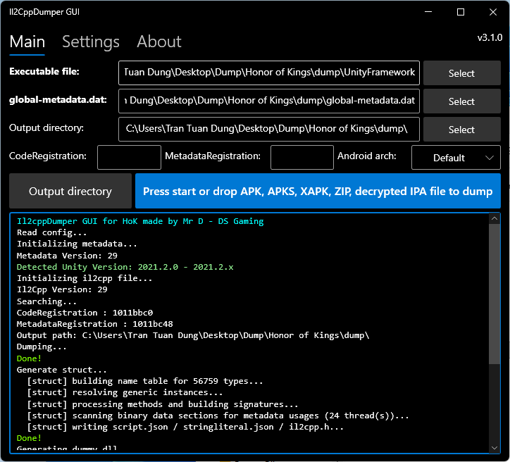

# Il2CppDumper GUI for HoK

This is a customized **Unity Il2CppDumper GUI** developed based on the original source code by **Perfare**.

✅ Runs on **Windows**
✅ Supports both **Android** and **iOS**
✅ Intuitive and user-friendly GUI
✅ Generates **structs**, **dummy DLLs**, and exports scripts for IDA Pro, Ghidra, and Hopper

---

## 🚀 How to Use

1. **Prepare your files:**
   - `libil2cpp.so` (Android) or `UnityFramework` / the main game `Executable` (iOS)
   - `global-metadata.dat`

2. Run `Il2CppDumper GUI`.

3. **Select your paths:**
   - **Executable file** → Point to your `libil2cpp.so`, `UnityFramework`, or the main game `Executable`.
   - **global-metadata.dat** → Point to the game's metadata file.
   - **Output directory** → Choose the folder where you want to save the dumped results.

4. Click **Start**. The tool will automatically:
   - Dump the binary data
   - Generate C# structures (`structs`)
   - Generate dummy DLLs
   - Copy analysis scripts to the output directory

5. Open the generated `dump.cs` or DummyDLL using **dnSpy** or **ILSpy** to begin your analysis.

---

## 🙏 Credits

- **[Perfare](https://github.com/Perfare)** – Original author of Il2CppDumper
- **[AndnixSH](https://github.com/AndnixSH)** – Developer of the previous GUI version
- **[quangbaong](https://github.com/quangbaong)** – Special thanks for the base source code from [Il2CppDumper GUI HOK](https://github.com/quangbaong/Il2CppDumper_GUI_HOK)
- **[Mr D - DS Gaming](https://github.com/dsgaming-mrd)** – Maintained and Enhanced GUI Edition
